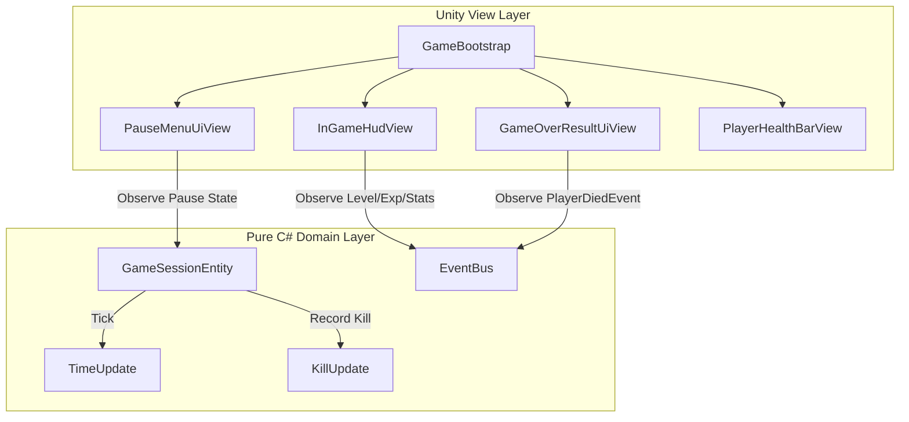

# 📋 구현 계획서: 1단계 인게임 상시 HUD & 게임 루프 UI (In-Game HUD & Game Loop UI)

---

## 1. 개요 및 목적
플레이어가 게임 플레이 중 자신의 상태(체력, 경험치, 레벨, 생존 시간, 처치 수)를 실시간으로 직관적으로 파악할 수 있도록 상시 HUD를 구축하고, 일시정지(ESC) 및 게임오버 결과창을 구현하여 완전한 인게임 플레이 루프를 완성합니다.

---

## 2. 세부 설계 및 아키텍처

### (1) Pure C# Domain Layer (`Assets/src/HappyShoot.Domain`)
1. **`Assets/src/HappyShoot.Domain/Session/GameSessionEntity.cs`**
   - 게임 상태 enum: `GameState { Playing, Paused, GameOver, Victory }`
   - 생존 시간(Survival Time) 초단위 누적 틱
   - 몬스터 처치 수(Kill Count) 및 획득 골드(Gold Earned) 관리
   - 무할당(Zero-allocation) 문자열 포맷팅 헬퍼 (시간 표시 최적화)
2. **`Assets/src/HappyShoot.Domain/Events/SessionEvents.cs`**
   - `GameStateChangedEvent(GameState prevState, GameState newState)`
   - `KillCountUpdatedEvent(int currentKills)`
   - `GoldGainedEvent(int amount, int totalGold)`
3. **`Assets/tests/HappyShoot.Domain.Tests/Session/GameSessionTests.cs`**
   - 세션 생성, 시간 틱, 킬 수 증가, 게임오버 상태 전이 단위 테스트

### (2) Unity View Layer (`Assets/src/HappyShoot.View`)
1. **`Assets/src/HappyShoot.View/UI/InGameHudView.cs`**
   - **상단 경험치 게이지 바**: 가로 전체 슬라이더 + 부드러운 Lerp 보간 + `Lv.X` 텍스트
   - **중앙 상단 타이머**: `MM:SS` 포맷 생존 시간 (StringBuilder 메모이제이션)
   - **우상단 상태 정보**: `💀 000 Kills`, `💰 000 Gold`
   - **좌상단 플레이어 HP 바**: 실시간 플레이어 체력 바 및 수치 표시 (`100 / 100`)
2. **`Assets/src/HappyShoot.View/UI/PlayerHealthBarView.cs`**
   - 플레이어 머리 위를 따라다니는 미니 HP 게이지 (월드/스크린 스페이스 최적화)
3. **`Assets/src/HappyShoot.View/UI/PauseMenuUiView.cs`**
   - `ESC` 키 입력 수신 시 일시정지 토글 (`Time.timeScale = 0f / 1f`)
   - `Resume(계속하기)`, `Restart(재시작)`, `Quit(종료)` 버튼
4. **`Assets/src/HappyShoot.View/UI/GameOverResultUiView.cs`**
   - `PlayerDiedEvent` 수신 시 활성화되는 세련된 다크 테마 결과창
   - 생존 시간, 도달 레벨, 총 킬 수, 획득 골드 최종 통계 표시
   - `Retry(다시 시작)`, `Main Menu` 버튼
5. **`Assets/src/HappyShoot.View/Bootstrap/GameBootstrap.cs` 수정**
   - 위 HUD 및 팝업 뷰들을 자동 인스턴싱하고 EventBus 및 PlayerView와 원클릭 바인딩

---

## 3. 성능 및 코드 품질 보장
- **500줄 제한 준수**: 각 컴포넌트를 단일 책임(SRP)에 맞게 작은 파일들로 분리
- **GC 무할당 원칙**: UI 텍스트 갱신 시 빈번한 `string` 결합 방지 및 변경 시에만 갱신하는 더티 체킹 적용
- **Blur 쉐이더 미사용**: 부드러운 HSL 기반의 다크 슬레이트 팔레트 사용

---

## 4. 검증 계획
1. `GameSessionTests.cs` 도메인 단위 테스트 작성 및 검증
2. C# 컴파일 확인 (오류 0건)
3. `APP_MAP.md`에 신규 모듈/인터페이스 업데이트
