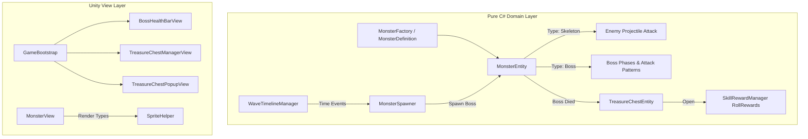

# 📋 구현 계획서: 2단계 몬스터 4종 다양화 & 보스전 & 보물상자 시스템 (Monster Variety, Boss Battles & Treasure Chests)

---

## 1. 개요 및 목적
단조로운 단일 슬라임 패턴을 탈피하여 다양한 이동/공격 패턴을 가진 **4종 몬스터(슬라임, 박쥐, 원거리 해골, 탱크 골렘)**를 도입하고, 시간 경과에 따라 등장하는 **보스 몬스터(돌진/탄막 패턴)**와 보스 처치 시 대량의 스킬/골드를 지급하는 **보물상자(Treasure Chest) 시스템**을 구축합니다.

---

## 2. 세부 설계 및 아키텍처

### (1) Pure C# Domain Layer (`Assets/src/HappyShoot.Domain`)
1. **`Assets/src/HappyShoot.Domain/Entities/MonsterType.cs` & `MonsterDefinition.cs`**
   - `MonsterType`: `Slime`(기본), `Bat`(고속/저체력), `Skeleton`(원거리 사격), `Golem`(돌진 탱크), `Boss`(대형 보스)
   - 몬스터 타입별 베이스 스탯(HP, MoveSpeed, Damage, AttackInterval, AttackRange) 정의
2. **`Assets/src/HappyShoot.Domain/Entities/MonsterEntity.cs` 확장**
   - 원거리 공격 쿨다운 및 플레이어와의 거리 유지 AI 로직 추가
   - 보스 플래그(`IsBoss`, `MaxHpMultiplier`) 및 보스 사망 이벤트 발행
3. **`Assets/src/HappyShoot.Domain/Chests/TreasureChestEntity.cs` & `ChestRewardManager.cs`**
   - 보스/엘리트 사망 시 월드 좌표에 보물상자 엔티티 스폰
   - 플레이어 접촉 시 1~3개 스킬 즉시 레벨업 + 보너스 골드 산출
4. **`Assets/src/HappyShoot.Domain/Events/ChestEvents.cs` & `BossEvents.cs`**
   - `BossSpawnedEvent(int bossId, string name, float maxHp)`
   - `BossHealthUpdatedEvent(int bossId, float currentHp, float maxHp)`
   - `BossDiedEvent(int bossId, Vector2D position)`
   - `TreasureChestOpenedEvent(int chestId, List<SkillRewardOption> rewards, int bonusGold)`
5. **`Assets/tests/HappyShoot.Domain.Tests/Monsters/MonsterVarietyTests.cs`**
   - 4종 몬스터 스펙 및 원거리 사격 주기 테스트
6. **`Assets/tests/HappyShoot.Domain.Tests/Chests/TreasureChestTests.cs`**
   - 보물상자 스폰, 플레이어 충돌 시 다중 보상 롤링 및 이벤트 발행 단위 테스트

### (2) Unity Presentation Layer (`Assets/src/HappyShoot.View`)
1. **`Assets/src/HappyShoot.View/Monsters/MonsterView.cs` 확장 & `SpriteHelper.cs` 스프라이트 추가**
   - 박쥐(Bat), 해골(Skeleton), 골렘(Golem), 드래곤/고블린 킹(Boss) 프로시저럴 비주얼 생성
2. **`Assets/src/HappyShoot.View/UI/BossHealthBarView.cs`**
   - 화면 상단에 웅장하게 나타나는 보스 전용 게이지 바 및 이름 표시 (`💀 GOBLIN KING - 2,500 / 2,500`)
3. **`Assets/src/HappyShoot.View/Chests/TreasureChestView.cs` & `TreasureChestPopupView.cs`**
   - 필드에 놓인 빛나는 황금 상자 렌더링
   - 상자 획득 시 팡파르 연출과 함께 1~3개 스킬 카드가 동시에 열리는 보물상자 전용 팝업
4. **`Assets/src/HappyShoot.View/Bootstrap/GameBootstrap.cs` 연동**
   - 보스 HUD 및 보물상자 매니저 자동 초기화 연결

---

## 3. 성능 및 코드 품질 보장
- **500줄 제한 엄수**: 몬스터 타입, 보스 로직, 상자 시스템을 작은 파일들로 분리
- **GC 무할당 풀링**: 보물상자 및 보스 투사체도 ObjectPool로 제어
- **SpatialGrid 최적화**: 보물상자도 SpatialGrid에 등록하여 $O(1)$ 거리 체크

---

## 4. 검증 계획
1. `MonsterVarietyTests.cs` 및 `TreasureChestTests.cs` 단위 테스트 작성 및 100% 통과 검증
2. C# 컴파일 에러 0건 확인
3. `APP_MAP.md` 및 `walkthrough.md` 업데이트
